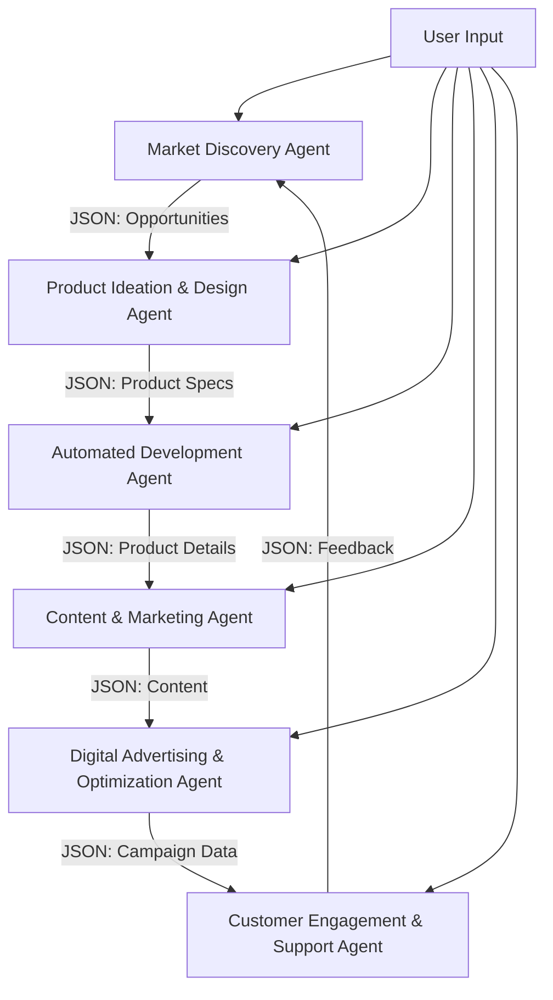

# Instant Autonomous Business Builder (IABB)

 

## Overview

The **Instant Autonomous Business Builder (IABB)** is an innovative cloud-based platform powered by a network of specialized AI agents that autonomously scout market opportunities, design and develop micro-SaaS solutions or digital products, launch targeted marketing campaigns, and manage customer engagement—all in near real-time. IABB aims to revolutionize digital entrepreneurship by automating the entire business lifecycle, enabling rapid creation and scaling of revenue-generating ventures with minimal human intervention.

This project leverages **CrewAI**, a framework for orchestrating autonomous AI agents, to implement six core agents: Market Discovery, Product Ideation & Design, Automated Development, Content & Marketing, Digital Advertising & Optimization, and Customer Engagement & Support. Built on modern cloud infrastructure and no-code/low-code platforms, IABB is designed for rapid prototyping, scalability, and iterative improvement.

## Vision

IABB envisions a "business factory" that democratizes entrepreneurship by:
- Identifying high-potential market niches using real-time data analysis.
- Rapidly designing and deploying tailored digital products.
- Automating marketing and customer engagement to drive conversions.
- Scaling multiple micro-SaaS ventures in parallel to maximize revenue.

The ultimate goal is to create a multibillion-dollar ecosystem that transforms how digital businesses are launched and managed, with a 48-hour proof-of-concept blueprint as the starting point.

## Features

- **Autonomous AI Agents**: Six specialized agents built with CrewAI to handle market discovery, product ideation, development, marketing, advertising, and customer support.
- **Real-Time Market Analysis**: Integrates with APIs for social media, search trends, and financial data to identify emerging opportunities.
- **Rapid Product Development**: Uses no-code/low-code platforms (e.g., Bubble, OutSystems) and AI code generators for near-instant product deployment.
- **Automated Marketing**: Generates high-converting content and optimizes ad campaigns across platforms like Google Ads and TikTok.
- **Customer Engagement**: Employs AI chatbots for support, upselling, and retention, ensuring a seamless user experience.
- **Scalable Architecture**: Designed for launching parallel ventures, with cloud-based infrastructure (AWS, Azure, or Google Cloud) for scalability.
- **Data-Driven Iteration**: Uses performance feedback to refine AI algorithms and improve market predictions.

## Architecture

IABB is structured around six autonomous AI agents, orchestrated by **CrewAI**, which enables collaborative task execution and data sharing. Each agent is designed to operate independently while integrating with others via JSON-based data exchange. The high-level architecture is as follows:



### Core Components

1. **Market Discovery Agent**:
   - **Function**: Scans global trends, social media, and financial data to identify niches.
   - **Tech**: CrewAI with LLM (e.g., GPT-4), integrated with APIs (X Platform, Google Trends, Crunchbase).
   - **Input**: Optional user-defined industries or keywords.
   - **Output**: JSON with niche descriptions, metrics, and opportunity scores.

2. **Product Ideation & Design Agent**:
   - **Function**: Generates product ideas and designs based on market gaps.
   - **Tech**: CrewAI with generative AI for ideation and UI mockups.
   - **Input**: Market opportunity JSON; optional user preferences (e.g., product type).
   - **Output**: JSON with product specs, features, and UI descriptions.

3. **Automated Development Agent**:
   - **Function**: Builds products using no-code/low-code platforms.
   - **Tech**: CrewAI with Bubble, OutSystems, and AI code generators (e.g., GitHub Copilot).
   - **Input**: Product specs JSON; optional user platform preferences.
   - **Output**: JSON with live URL, implemented features, and deployment details.

4. **Content & Marketing Agent**:
   - **Function**: Creates landing pages, blogs, social posts, and video scripts.
   - **Tech**: CrewAI with GPT-4 for content generation and A/B testing tools.
   - **Input**: Product details JSON; optional user style/channel preferences.
   - **Output**: JSON with content and schedules.

5. **Digital Advertising & Optimization Agent**:
   - **Function**: Launches and optimizes ad campaigns across platforms.
   - **Tech**: CrewAI with ad platform APIs (Google Ads, Meta) and ML for optimization.
   - **Input**: Content JSON; optional user budget/platform preferences.
   - **Output**: JSON with campaign metrics and recommendations.

6. **Customer Engagement & Support Agent**:
   - **Function**: Manages customer support, upselling, and retention via chatbots.
   - **Tech**: CrewAI with Dialogflow, Rasa, and CRM integration (e.g., HubSpot).
   - **Input**: Product and campaign data JSON; optional user tone/priority preferences.
   - **Output**: JSON with interaction summaries and feedback.

### Tech Stack

- **Framework**: CrewAI for agent orchestration.
- **AI Models**: GPT-4 or equivalent LLMs for ideation, content, and analysis.
- **Cloud Infrastructure**: AWS, Azure, or Google Cloud for serverless functions and hosting.
- **No-Code/Low-Code**: Bubble, OutSystems, Adalo for rapid development.
- **APIs**:
  - Data: X Platform, Google Trends, Crunchbase, Yahoo Finance.
  - Ads: Google Ads, Meta Ads, TikTok Ads.
  - CRM: HubSpot, Salesforce.
  - Conversational AI: Dialogflow, Rasa.
- **Frontend**: React, Tailwind CSS for admin interfaces (optional).
- **Backend**: Node.js, Python (for CrewAI scripts), Firebase for data storage.
- **Version Control**: Git, GitHub.

## Getting Started

### Prerequisites

- **Python**: Version 3.8 or higher.
- **CrewAI**: Install via `pip install crewai`.
- **API Keys**:
  - X Platform API, Google Trends, Crunchbase, etc., for data access.
  - Google Ads, Meta Ads for advertising.
  - Dialogflow or Rasa for chatbots.
- **Cloud Account**: AWS, Azure, or Google Cloud for hosting.
- **No-Code Platforms**: Accounts for Bubble, OutSystems, or Adalo.
- **Git**: For version control.
- **Node.js**: For optional frontend development.

### Installation

1. **Clone the Repository**:
   ```bash
   git clone https://github.com/your-username/iabb.git
   cd iabb
   ```

2. **Set Up Virtual Environment**:
   ```bash
   python -m venv venv
   source venv/bin/activate  # On Windows: venv\Scripts\activate
   ```

3. **Install Dependencies**:
   ```bash
   pip install -r requirements.txt
   ```

4. **Configure Environment Variables**:
   - Create a `.env` file in the root directory.
   - Add API keys and configuration:
     ```env
     X_API_KEY=your_x_api_key
     GOOGLE_TRENDS_API_KEY=your_google_trends_key
     AWS_ACCESS_KEY_ID=your_aws_key
     AWS_SECRET_ACCESS_KEY=your_aws_secret
     BUBBLE_API_TOKEN=your_bubble_token
     DIALOGFLOW_PROJECT_ID=your_dialogflow_id
     ```

5. **Initialize CrewAI Agents**:
   - Run the agent setup script to configure CrewAI tasks and workflows:
     ```bash
     python scripts/setup_agents.py
     ```

6. **Launch the Platform**:
   - Start the main application to initialize agents and begin market discovery:
     ```bash
     python main.py
     ```

### Project Structure

```plaintext
iabb/
├── agents/                    # CrewAI agent definitions
│   ├── market_discovery.py
│   ├── product_ideation.py
│   ├── automated_development.py
│   ├── content_marketing.py
│   ├── digital_advertising.py
│   └── customer_engagement.py
├── config/                    # Configuration files
│   ├── api_keys.yaml
│   └── agent_workflows.yaml
├── scripts/                   # Setup and utility scripts
│   ├── setup_agents.py
│   └── deploy_product.py
├── static/                    # Static assets (e.g., UI templates)
├── templates/                 # HTML/CSS for landing pages
├── tests/                     # Unit and integration tests
├── .env                       # Environment variables
├── main.py                    # Main application entry point
├── requirements.txt           # Python dependencies
└── README.md                  # This file
```

## Usage

1. **Run Market Discovery**:
   - The Market Discovery Agent scans for opportunities every 6 hours or on demand:
     ```bash
     python agents/market_discovery.py --industry "fintech" --region "global"
     ```

2. **Generate Product Ideas**:
   - Pass opportunity JSON to the Product Ideation Agent:
     ```bash
     python agents/product_ideation.py --input opportunity.json
     ```

3. **Build a Product**:
   - Use the Automated Development Agent to deploy a product:
     ```bash
     python agents/automated_development.py --specs product_specs.json --platform "bubble"
     ```

4. **Launch Marketing Campaigns**:
   - Generate and publish content:
     ```bash
     python agents/content_marketing.py --product product_details.json --channel "instagram"
     ```

5. **Optimize Ads**:
   - Launch and monitor ad campaigns:
     ```bash
     python agents/digital_advertising.py --content content.json --budget 100
     ```

6. **Manage Customers**:
   - Deploy chatbots for customer support:
     ```bash
     python agents/customer_engagement.py --product product_details.json --tone "friendly"
     ```

## Contributing

We welcome contributions to IABB! To contribute:

1. **Fork the Repository**:
   - Click the "Fork" button on GitHub and clone your fork.

2. **Create a Branch**:
   ```bash
   git checkout -b feature/your-feature-name
   ```

3. **Make Changes**:
   - Follow the coding style (PEP 8 for Python, ESLint for JavaScript).
   - Update tests in the `tests/` directory.

4. **Submit a Pull Request**:
   - Push your branch and create a PR with a clear description.
   - Reference any issues (e.g., `Fixes #123`).

5. **Code Review**:
   - Ensure your code passes CI/CD checks (e.g., linting, tests).
   - Address reviewer feedback promptly.

See [CONTRIBUTING.md](CONTRIBUTING.md) for detailed guidelines.

## Roadmap

- **Q2 2025**: Complete MVP with one micro-SaaS product launch.
- **Q3 2025**: Integrate advanced ML for predictive analytics in advertising.
- **Q4 2025**: Scale to 10 parallel micro-SaaS ventures.
- **Q1 2026**: Release white-label solution for enterprise clients.
- **Q2 2026**: Secure venture funding for global expansion.

## Challenges & Considerations

- **Regulatory Compliance**: Adhere to GDPR, CCPA, and copyright laws for AI-generated content and data handling.
- **Quality Control**: Implement human oversight for early-stage outputs to ensure credibility.
- **Market Saturation**: Continuously evolve agents to identify novel opportunities.
- **Security**: Invest in cybersecurity to protect customer data and operations.

## License

This project is licensed under the MIT License. See [LICENSE](LICENSE) for details.

## Contact

- **Maintainer**: [Ajit] (ajitonmail@gmaol.com)
- **GitHub Issues**: Report bugs or suggest features 
- **Community**: Join our [Discord Server]  for discussions

## Acknowledgments

- **CrewAI**: For providing the framework to orchestrate autonomous agents.
- **Open-Source Community**: For tools like Bubble, Dialogflow, and GPT-4 integrations.
- **Contributors**: Thanks to all who help make IABB a reality!

---

**Instant Autonomous Business Builder** is a bold step toward automating digital entrepreneurship. Join us in building the future of business creation!
